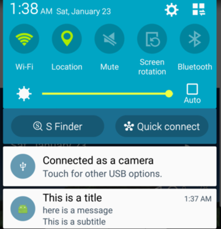

# Android GCM - only a sample

## Android GCM - Google Cloud Message
This is a simple example of how to use GCM in Android applications. My motivation is help users to put this feature in your applications, because in some topics, I saw problems in how to implement it, but in general is very easy.

To create this repository, I read [official GCM Page](https://developers.google.com/cloud-messaging/) and Android API.

I will suppose that you have your bundle id application (in AndroidManifest.xml), in my example I will use:

```xml
<manifest xmlns:android="http://schemas.android.com/apk/res/android"
    package="com.example.brunogabriel.nativegcm">
```

### Register your account
First it is necessary to create and enable GCM by making a project, steps:

1. With your package android in hands:
	- Enter in [Google Developers Console] (http://console.developers.google.com) and create your own application, in my case named Native GCM.
	
2. Do not forgot to save your `project number`, we will use it in Android Application directly.

3. Create your credentials:
    - When I made it, I did not saved an IP Address, only empty this field to test.
    - So now, write your credentials key.

### Configuration: Android application
In Android project:

1. First, please, read as soon as possible all comments (small quantity) in `.java` files, because some contains tips, e.g. in function `executeBusinessRule`, its possible for users save unique device id in databases (like chat application, to send notification or start a chat).  

2. In gradle file, has an important dependency: `com.google.android.gms:play-services:8.4.0`, to enable receive data.

3. In `string.xml`, don't forgot to change `gcm_default_sender_id` value to your `project number` (step 2 in register account).

4. Please, see implementation in `AndroidManifest.xml`, because there are features necessary to application work correctly.

5. In `MainActivity`, we'll register your unique device id, first this application will validate if play services is enabled by calling `isEnablePlayService`, if there is no error, start 'RegistrationIntentService'. 

6.  I advise all people to debug this app and collect first unique device id, to do, put a break point in `RegistrationIntentService` method `onHandleIntent` or `executeBusinessRule` to get this value, don't forget to write this in your notes to test server after. Do not forget, every time you install the application this id changes. 

### Some explanations
In `GCMListenerService` we've important features:

1. `onMessageReceived` - Contains a bundle received, in our case, JSON Data (Bundle). 
2. `sendNotification` - Method that calls a device [local notification](http://developer.android.com/reference/android/support/v4/app/NotificationCompat.html), push alert.

Screenshots
-----------



